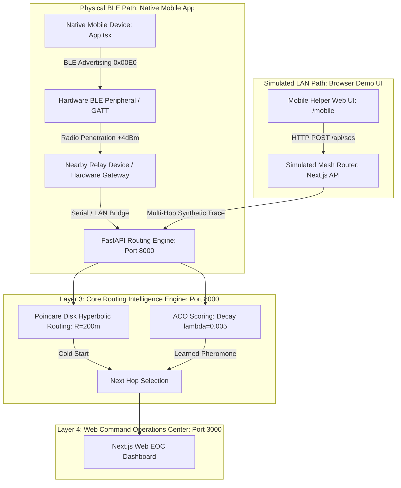

# ◈ AETHERIS: 4-Layer Emergency Mesh & Disaster Intelligence System
## Complete Architecture, Features & Operational Documentation

> **Aetheris** is an offline-first emergency mesh communication and disaster response system designed to locate and rescue trapped victims when traditional cellular infrastructure, internet, or power grids fail.

---

## 🏛️ System Architecture Overview

Aetheris is built upon a **4-Layer Modular Mesh Architecture**:



---

## 📡 Physical BLE vs. Simulated LAN Transport Architecture

Aetheris supports two operational transport paths:

1. **Physical BLE Mesh Path (Production Native App):**
   - Implemented in `App.tsx` and native React Native modules.
   - Uses real hardware 2.4GHz Bluetooth Low Energy advertising packets with standard 0x00E0 manufacturer ID.
   - Operates fully off-grid without Wi-Fi, cellular, or IP infrastructure.
   - Packet framing utilizes the strict 18-byte big-endian compact binary struct with Fletcher-16 checksum.

2. **Simulated LAN Transport Path (Web & Browser Demo):**
   - Implemented in `/mobile` (`dashboard/src/app/mobile/page.tsx`) and the web receiver dashboard.
   - Designed for browser environments (Chrome/Safari) where direct raw BLE packet transmission is restricted by browser security sandboxes.
   - Explicitly labeled with **`Transport: Simulated mesh over LAN (WebSocket/HTTP)`** and **`SIMULATION MODE`** badges.
   - Emulates multi-hop routing, hop counters, TTL decrementing, and Fletcher-16 recomputation across the mesh.

---

## 📱 1. Mobile Application (React Native / Expo & Mobile Web)

The mobile application acts as both a **Victim Emergency Beacon** and a **Helper Relay Node**.

### Key Features & Components

1. **Custom Sender Identity & 32-bit FNV-1a Truncated to 16 Bits:**
   - Converts human-readable identities (e.g. `Room 222 - Victim (Wall Blocked)`, `Rescue Unit 1`) into a 32-bit Uint32 FNV-1a hash (`0x811c9dc5` basis), truncated to 16 bits (`hash32 & 0xFFFF`) for wire packing.
   - Packs the hash into the 2.4GHz BLE Manufacturer Data payload (`0x00E0`).

2. **18-Byte Compact Binary Struct Serialization:**
   - Compresses complete emergency telemetry into an ultra-low-bandwidth 18-byte binary frame (big-endian everywhere):
     - `Bytes 0-1`: Packet Sequence ID (Uint16 big-endian)
     - `Byte 2`: Priority Level (0=Routine, 1=Medium, 2=High, 3=Critical)
     - `Bytes 3-6`: Scaled Latitude ($lat \times 10^6$, Int32 big-endian)
     - `Bytes 7-10`: Scaled Longitude ($lng \times 10^6$, Int32 big-endian)
     - `Byte 11`: Battery Percentage (Uint8)
     - `Byte 12`: Hop Count (Uint8, incremented at each relay hop)
     - `Bytes 13-14`: Sender Hash (Uint16 big-endian, 32-bit FNV-1a truncated to 16 bits)
     - `Bytes 15`: TTL (Uint8, decremented at each relay hop; dropped when $\le 0$)
     - `Bytes 16-17`: Fletcher-16 CRC Checksum (Uint16 big-endian, calculated over bytes 0..15; recomputed at every relay via `relayBinaryPacket`)

3. **Deduplication & Serial-Number Wraparound:**
   - 60-second TTL packet deduplication cache per `(sender_hash, packet_id)`.
   - Serial number arithmetic handles 16-bit wraparound: a packet is considered newer if:
     $$(p_{\text{new}} - p_{\text{cached}}) \pmod{65536} < 32768$$
   - Stale duplicate packets or packets with $\text{TTL} \le 0$ are dropped immediately.

4. **High-Power Radio Advertising (`+4dBm` TX Power):**
   - Transmits raw 2.4GHz BLE advertisement frames at maximum hardware TX power to penetrate concrete walls, multi-story floors, and indoor obstacles (Room 222 to Room 422).

5. **Building Subnet UDP Broadcast Bridge:**
   - If physical Bluetooth RF is heavily attenuated by thick concrete slabs, the network bridge automatically emits local UDP broadcast packets (`192.168.0.255` / `255.255.255.255`) across local building Wi-Fi access points (even without internet access).

6. **1-Tap Animated Emergency SOS Button:**
   - **TRANSMIT SOS**: Triggers red pulsating animation, activates hardware vibration pattern (`[0, 500, 200, 500]`), locks GPS coordinates, and starts continuous re-transmission.
   - **CANCEL SOS**: Broadcasts a cancellation signal across the mesh, immediately clearing the emergency alert from the Command Center.

7. **Multi-Hop Room Hop Path Telemetry:**
   - Displays real-time relay hops:
     $$\text{Room 222 (Concrete Blocked)} \xrightarrow{\text{BLE Mesh}} \text{Room 322 (Relay)} \xrightarrow{\text{Building Bridge}} \text{Room 422 (Web EOC Sink)}$$

---

## ⚙️ 2. FastAPI Mesh Routing Intelligence Engine (Python Backend)

The backend engine (`backend/app/`) runs on **Port 8000** and provides Layer 3 routing intelligence using two mathematical models:

### A. Poincaré Disk Hyperbolic Greedy Routing (`HYPERBOLIC_COLD_START`)
Used for **zero-history cold-start path selection** when no pheromone trails exist.

- **Local Euclidean Metric Projection:**
  Converts geographic latitude/longitude into local Euclidean meters $(\Delta x, \Delta y)$ relative to the Command Center reference point:
  $$\Delta y = (\text{lat} - \text{lat}_{\text{ref}}) \times 111{,}320\text{ m}$$
  $$\Delta x = (\text{lng} - \text{lng}_{\text{ref}}) \times 111{,}320 \times \cos(\text{lat}_{\text{ref}})\text{ m}$$
- **Poincaré Disk Projection:**
  Maps Euclidean distance $\rho = \frac{\sqrt{\Delta x^2 + \Delta y^2}}{R}$ (with configurable curvature scale $R = 200\text{ m}$) into the Poincaré open unit disk $\|(u, v)\| < 1$:
  $$r_{\text{disk}} = \tanh\left(\frac{\rho}{2}\right)$$
  Clamped strictly to $\|(u,v)\| \le 0.999$ to avoid hyperbolic boundary singularities.
- **Guarded Hyperbolic Metric Distance:**
  $$d_H(u, v) = \operatorname{arcosh}\left(\max\left(1.0, \, 1 + \frac{2\|u - v\|^2}{(1 - \|u\|^2)(1 - \|v\|^2)}\right)\right)$$
- **Selection Rule:** Selects the candidate node that minimizes the hyperbolic metric distance to the target rescue destination.

### B. Ant Colony Optimization (ACO) Combined Scoring (`ACO_LEARNED`)
Used once successful routes leave pheromone trails. Transitions automatically from `HYPERBOLIC_COLD_START` to `ACO_LEARNED` once history is recorded.

- **Passive Exponential Pheromone Decay:**
  Pheromone trails decay naturally over time:
  $$\tau(t) = \tau_0 \cdot e^{-\lambda t}$$
  where $\lambda = 0.005\text{ s}^{-1}$ (yielding a half-life of $t_{1/2} = \frac{\ln 2}{0.005} \approx 138.6\text{ seconds} \approx 2.3\text{ minutes}$).
- **Multi-Objective Normalized Combined Scoring Formula:**
  All four terms are normalized to $[0, 1]$:
  $$\text{Score}(n) = \alpha \cdot \tau + \beta \cdot \left(\frac{1}{1 + d_H}\right) + \gamma \cdot \text{Battery} + \delta \cdot \text{LinkQuality}$$
  where default weights are $\alpha = 0.35, \beta = 0.35, \gamma = 0.15, \delta = 0.15$ (summing to $1.0$, configurable via environment variables).
- **Hard Failure Penalty:**
  Missing ACKs or broken links trigger an immediate **$-90\%$ hard pheromone penalty** on that edge:
  $$\tau_{\text{new}} = \max(0.01, \, \tau \times 0.1)$$

---

## 🖥️ 3. Web Command Operations Center (Web EOC Dashboard)

The Web Command Center (`dashboard/`) runs on **Port 3000** and provides real-time situational awareness for emergency responders.

### Visual Components & Features

1. **Clean Standby Operational Mode (0 Initial Dummy Tickets):**
   - Starts with **0 active tickets** (`liveSOSTickets = []`).
   - Displays a clean green operational banner: `🟢 SYSTEM OPERATIONAL - 0 ACTIVE EMERGENCY ALERTS - CONTINUOUS BLE SCANNER LISTENING`.

2. **Continuous 360° Live SOS Radar Scanner:**
   - Animated radar sweep line rendering real-time nodes on polar coordinates based on distance and bearing.
   - Highlights critical emergency nodes in flashing red and routine heartbeat nodes in green.

3. **Bento Grid Triage Feed:**
   - Displays victim cards sorted by **Criticality Level**, **Age**, **Battery Level**, or **Geodesic Distance**.
   - Includes 1-tap action buttons: **DISPATCH RESCUE TEAM** and **RESOLVE TICKET**.
   - Prominently displays the **MULTI-HOP BLE RELAY PATH** banner for each incoming signal.

4. **Poincaré Hyperbolic Mesh Canvas:**
   - Dynamic 2D HTML5 canvas plotting hyperbolic metric arcs and candidate hops inside the Poincaré disk.

5. **ACO Routing & Pheromone Engine Panel:**
   - Real-time display of edge pheromones ($\tau$), decay rates ($\lambda$), and combined candidate scores computed by the FastAPI engine.

---

## 🔄 End-to-End Operational Workflow (Room 222 Disaster Scenario)

```text
[ Victim in Room 222 ]
        │ Taps "TRANSMIT SOS"
        ▼
[ 18-Byte Binary Packet Built ]
        │ FNV-1a Hash + Fletcher-16 CRC + +4dBm TX Power
        ▼
[ BLE 2.4GHz Radio & Building UDP LAN Broadcast ]
        │ Wall hindrance bypassed via intermediate Room 322 relay
        ▼
[ FastAPI Routing Engine (:8000) ]
        │ Computes Hyperbolic Distance d_H & ACO Pheromone Score
        │ Reinforces successful edge trace / applies missing ACK penalty
        ▼
[ Web Command EOC Dashboard (:3000) ]
        │ < 1 Sec Instant Sync: Alarm sounds, Red Warning Card pops up
        │ Geolocates exact GPS coordinates & displays multi-hop room path
        ▼
[ Rescuers Dispatched to Room 222 ]
```

---

## 🌐 Server Endpoints Summary

| Service | Port | Endpoint | Description |
| :--- | :--- | :--- | :--- |
| **Web EOC Dashboard** | `3000` | `http://localhost:3000` | Main Command Dashboard UI |
| **Mobile App (Web UI)** | `3000` | `http://localhost:3000/mobile` | Direct Safari/Chrome Mobile App UI |
| **FastAPI Routing Engine** | `8000` | `http://localhost:8000/docs` | Swagger API Docs for Hyperbolic & ACO |
| **FastAPI Route Decision** | `8000` | `POST /api/v1/packets/route` | Route calculation endpoint |
| **FastAPI ACK/Penalty** | `8000` | `POST /api/v1/ack` | ACK reinforcement & failure penalty |
| **Expo Metro Server** | `8081` | `exp://<local-ip>:8081` | Expo Go Metro Bundler |

---

*Documentation compiled for Aetheris Emergency Mesh Version 2.0.0.*
